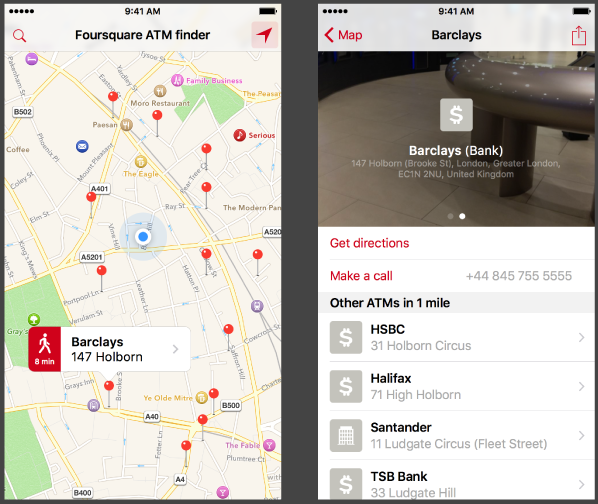

ATM-Finder
---------------
ATM-Finder is a sample iOS app which uses the [FourSquare API](https://developer.foursquare.com/) to find ATMs near the user in London and show them on a map.

Purpose
--------------

I have been working on this project recently as part of an application process for a iOS developer vacancy in a London company. The mockup that they sent to me has been taken into consideration in the work below. 

The assignment was:

>Baldrick, a very junior developer at your company, 
has been working on a simple app called "ATM Finder".

>You've inherited Baldrick's unfinished project, and 
a design mockup for ATM Finder. It also looks like 
the project might have a couple of bugs.

>Your job is to finish up the project, and fix any 
bugs you might come across. You have complete free 
reign to change, rewrite, delete any or all parts 
of the project as you see fit. You own this project 
now.

The whole process has taken me approximately 12 hours. This involved designing icons, fixing bugs and cleaning up the code. This task was taken very seriously and I have done my best to take the project as far as I can. 

I hope you like it and I look forward to hearing any feedback.

How to run it
--------------
1. Clone the repository `git@github.com:pastorin/ATM-Finder.git`.
2. Move to the [Finished Project folder](/FinishedProject).
3. Open ATM Finder workspace using XCode and run the project.
4. [Set the location in the Simulator](http://stackoverflow.com/questions/214416/set-the-location-in-iphone-simulator) to lat:51.512 lon:-0.112 
5. Enjoy it!. 

Contact
--------------
[Martin Pastorin](https://ie.linkedin.com/in/mpastorin "Martin Pastorin Linkedin") (pastorin.m@gmail.com)